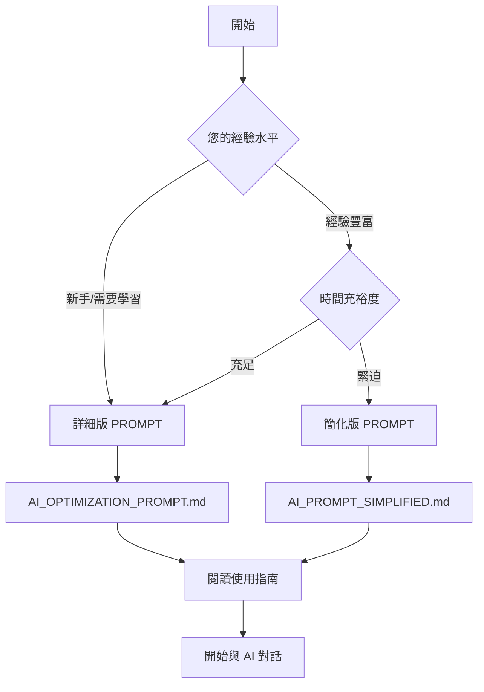

# 🤖 AI PROMPT 資源索引

> 為 Dungeon Delvers 專案優化而設計的完整 AI PROMPT 套件

## 📚 文件清單

### 🎯 AI PROMPT 主要文件

| 文件名 | 用途 | 適用場景 | 詳細程度 |
|--------|------|----------|----------|
| `AI_OPTIMIZATION_PROMPT.md` | 完整優化 PROMPT | 深度優化、學習導向 | ⭐⭐⭐⭐⭐ |
| `AI_PROMPT_SIMPLIFIED.md` | 簡化版 PROMPT | 快速執行、經驗豐富 | ⭐⭐⭐ |
| `HOW_TO_USE_AI_PROMPTS.md` | 使用指南 | 學習如何使用 PROMPT | ⭐⭐⭐⭐ |

### 📋 支援文件

| 文件名 | 說明 |
|--------|------|
| `project-analysis-report.md` | 實際分析報告示例 |
| `optimization-guide.md` | 技術實施參考 |
| `setup-optimization.md` | 設置步驟參考 |
| `OPTIMIZATION_README.md` | 總覽指南 |

## 🚀 快速開始

### 選擇適合的 PROMPT



### 使用流程

1. **📖 閱讀** `HOW_TO_USE_AI_PROMPTS.md`
2. **🎯 選擇** 適合的 PROMPT 版本
3. **📋 複製** PROMPT 內容
4. **🤖 對話** 與 AI 開始優化
5. **✅ 驗證** 實施成果

## 📊 PROMPT 比較

### 詳細版 vs 簡化版

| 特性 | 詳細版 | 簡化版 |
|------|--------|--------|
| **文字長度** | 15,000+ 字 | 2,000+ 字 |
| **技術背景** | 詳細解釋 | 簡要說明 |
| **實施指導** | 逐步教學 | 直接指令 |
| **程式碼示例** | 豐富範例 | 核心範例 |
| **質量標準** | 詳細規範 | 核心指標 |
| **適用時間** | 5-8 週計劃 | 2-3 週計劃 |

## 🎯 使用建議

### 第一次使用
👉 **推薦**: 詳細版 PROMPT
- 提供完整的學習和理解
- 包含最佳實踐說明
- 詳細的錯誤處理指導

### 後續優化
👉 **推薦**: 簡化版 PROMPT
- 快速執行特定任務
- 專注於核心功能
- 效率導向

### 團隊使用
```markdown
# 團隊角色分工建議

## 架構師/技術領導
- 使用詳細版 PROMPT
- 負責整體規劃和技術決策

## 資深開發者
- 使用簡化版 PROMPT
- 負責具體實施和優化

## 初級開發者
- 使用詳細版 PROMPT
- 學習最佳實踐和原理
```

## 💡 進階技巧

### 自定義 PROMPT
```markdown
基於提供的 PROMPT 模板，您可以：

1. 調整技術棧要求
2. 修改優先級重點
3. 添加特殊需求
4. 調整時程安排
```

### 組合使用
```markdown
階段 1: 使用詳細版進行分析和規劃
階段 2: 使用簡化版進行快速實施
階段 3: 使用詳細版進行深度優化
```

## 🔧 故障排除

### 常見問題

**Q1: AI 不理解我的專案結構？**
```markdown
在 PROMPT 後補充：
- package.json 主要依賴
- 專案目錄結構
- 特殊配置說明
```

**Q2: 生成的配置無法運行？**
```markdown
提供具體錯誤信息，要求 AI 修正：
"請修正這個配置，我遇到以下錯誤：[錯誤詳情]"
```

**Q3: 優化效果不明顯？**
```markdown
要求基線測量和對比：
"請提供測量當前效能的方法，並設定改進目標"
```

## 📈 成功案例模板

### 使用詳細版 PROMPT 的預期對話流程

```markdown
用戶: [貼上完整的 AI_OPTIMIZATION_PROMPT.md]

AI: 我將為您的 Dungeon Delvers 專案進行全面優化...

用戶: 請先執行 Phase 1，創建測試框架

AI: [提供完整的測試配置和文件]

用戶: 配置沒問題，請繼續 Phase 2

AI: [提供智能合約測試方案]
...
```

### 使用簡化版 PROMPT 的預期對話流程

```markdown
用戶: [貼上 AI_PROMPT_SIMPLIFIED.md + 專案具體資訊]

AI: 明白了，我將快速為您設置測試和優化...

用戶: 請創建所有必要的配置文件

AI: [一次性提供所有核心配置]
```

## 🎉 總結

這套 AI PROMPT 資源包含：

✅ **2 個主要 PROMPT** (詳細版 + 簡化版)  
✅ **1 個詳細使用指南**  
✅ **4 個參考文檔** (分析報告、技術指南等)  
✅ **1 個自動化腳本** (quick-setup.sh)  

**適用於**: React + TypeScript + Web3 專案的測試與效能優化

**目標**: 將專案品質從 ⭐⭐⭐⭐ 提升到 ⭐⭐⭐⭐⭐

---

**開始您的優化之旅**: 選擇適合的 PROMPT，複製內容，開始與 AI 對話！ 🚀