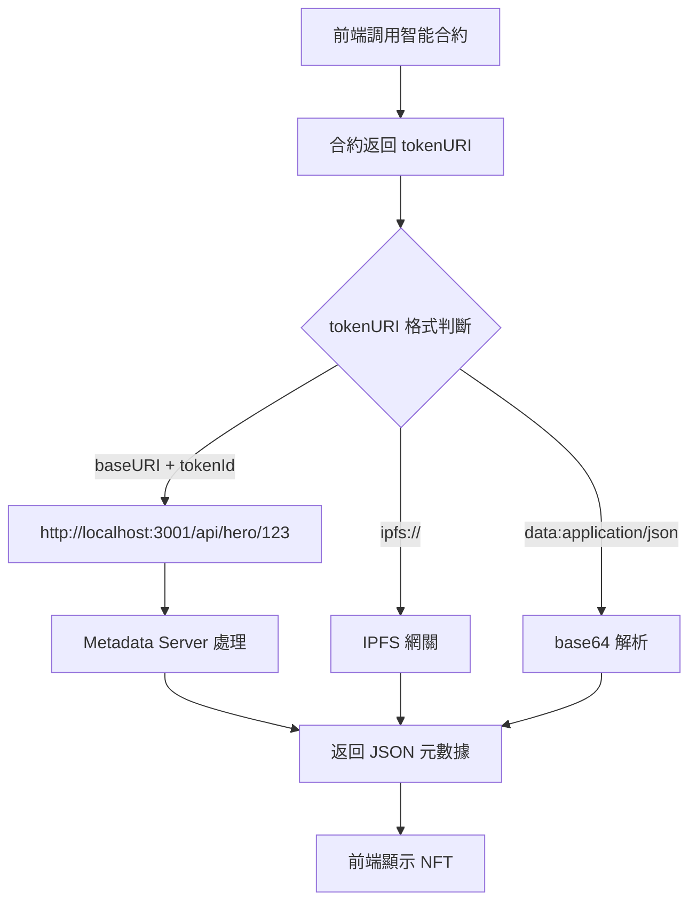

# 🔍 Metadata Server API 調用機制解析

## 🎯 您的疑問解答

您問得很對！Metadata Server API (`http://localhost:3001/api/hero/:tokenId` 等) **不是獨立存在的**，而是需要通過特定的設定才能被調用。

## 🔗 完整的調用鏈

### 1. **智能合約 tokenURI 設定**

所有的 NFT 合約都有相同的 `tokenURI` 實現：

```solidity
function tokenURI(uint256 tokenId) public view override returns (string memory) {
    _requireOwned(tokenId);
    require(bytes(baseURI).length > 0, "Contract: baseURI not set");
    return string(abi.encodePacked(baseURI, tokenId.toString()));
}
```

**關鍵**：`baseURI` 必須由合約管理員設定為指向 Metadata Server！

### 2. **baseURI 設定步驟**

管理員需要調用每個合約的 `setBaseURI` 函數：

```javascript
// 設定 Hero 合約的 baseURI
await heroContract.setBaseURI("http://localhost:3001/api/hero/");

// 設定 Relic 合約的 baseURI
await relicContract.setBaseURI("http://localhost:3001/api/relic/");

// 設定 Party 合約的 baseURI
await partyContract.setBaseURI("http://localhost:3001/api/party/");

// 設定 VIP 合約的 baseURI
await vipContract.setBaseURI("http://localhost:3001/api/vip/");

// 設定 Profile 合約的 baseURI
await profileContract.setBaseURI("http://localhost:3001/api/profile/");
```

### 3. **調用流程詳解**



## 🔧 具體的設定情況

### 情況 1：如果 baseURI 未設定或設定錯誤

```javascript
// 如果 baseURI 是空的
heroContract.baseURI() // 返回 ""

// 前端調用 tokenURI(123) 會失敗
heroContract.tokenURI(123) // 拋出錯誤: "Hero: baseURI not set"
```

### 情況 2：如果 baseURI 設定為 IPFS

```javascript
// 如果管理員設定為 IPFS
await heroContract.setBaseURI("ipfs://QmYourHashHere/");

// 前端調用 tokenURI(123)
heroContract.tokenURI(123) // 返回 "ipfs://QmYourHashHere/123"

// 前端會調用 IPFS 網關，不會調用 Metadata Server
```

### 情況 3：如果 baseURI 設定為 Metadata Server

```javascript
// 如果管理員設定為 Metadata Server
await heroContract.setBaseURI("http://localhost:3001/api/hero/");

// 前端調用 tokenURI(123)
heroContract.tokenURI(123) // 返回 "http://localhost:3001/api/hero/123"

// 前端會調用 Metadata Server API
```

## 🎮 實際的部署配置

根據您的專案結構，**目前可能的情況**：

### 可能情況 1：開發階段，baseURI 尚未設定
```javascript
// 合約剛部署，baseURI 還是空的
console.log(await heroContract.baseURI()); // 輸出: ""

// 這時候前端調用會失敗
```

### 可能情況 2：使用 IPFS 存儲
```javascript
// 如果使用 IPFS 存儲元數據
console.log(await heroContract.baseURI()); // 輸出: "ipfs://QmSomeHash/"

// 前端會調用 IPFS 網關，不會調用 Metadata Server
```

### 可能情況 3：已配置 Metadata Server
```javascript
// 如果已經配置了 Metadata Server
console.log(await heroContract.baseURI()); // 輸出: "http://localhost:3001/api/hero/"

// 前端會調用 Metadata Server API
```

## 🔍 檢查當前設定

### 1. 檢查智能合約的 baseURI

```javascript
// 連接到合約並檢查 baseURI
import { createPublicClient, http } from 'viem';
import { bsc } from 'viem/chains';

const client = createPublicClient({
  chain: bsc,
  transport: http()
});

// 檢查 Hero 合約
const heroBaseURI = await client.readContract({
  address: "0x您的Hero合約地址",
  abi: heroAbi,
  functionName: 'baseURI'
});

console.log("Hero baseURI:", heroBaseURI);
```

### 2. 檢查前端的實際調用

在瀏覽器的開發者工具中：
1. 打開 Network 標籤頁
2. 嘗試載入 NFT
3. 查看實際發送的請求

如果您看到：
- `https://ipfs.io/ipfs/...` - 說明使用 IPFS
- `http://localhost:3001/api/...` - 說明使用 Metadata Server
- 沒有請求 - 可能是 baseURI 未設定

## 🛠️ 設定 Metadata Server 的步驟

### 1. 啟動 Metadata Server

```bash
cd dungeon-delvers-metadata-server
npm install
npm start
# 服務器在 http://localhost:3001 運行
```

### 2. 設定智能合約的 baseURI

```javascript
// 使用 ethers.js 或 viem 設定 baseURI
const tx = await heroContract.setBaseURI("http://localhost:3001/api/hero/");
await tx.wait();

// 對所有合約重複此操作
await relicContract.setBaseURI("http://localhost:3001/api/relic/");
await partyContract.setBaseURI("http://localhost:3001/api/party/");
await vipContract.setBaseURI("http://localhost:3001/api/vip/");
await profileContract.setBaseURI("http://localhost:3001/api/profile/");
```

### 3. 驗證設定

```bash
# 測試 API 端點
curl http://localhost:3001/api/hero/1
curl http://localhost:3001/api/relic/1
curl http://localhost:3001/health
```

## 🌟 總結

**回答您的問題**：

1. **Metadata Server API 不是獨立的**，需要智能合約的 `baseURI` 指向它
2. **子圖和前端本身不直接調用** Metadata Server API
3. **只有當智能合約的 `baseURI` 設定為 Metadata Server 時**，前端才會間接調用這些 API
4. **目前的設定情況**需要檢查智能合約的 `baseURI` 值來確認

這就是為什麼您感到困惑的原因 - 這個調用鏈需要特定的配置才能激活！