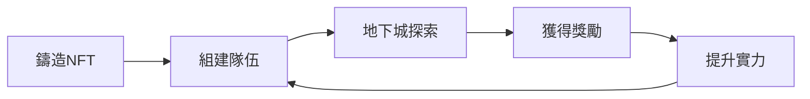

# DungeonDelvers 白皮書 v5.0
*構建可持續的 Web3 遊戲生態系統 - V25 技術革新版*

<div align="center">
  
  
  **最後更新**: 2025年7月 V25 版本  
  **官方網站**: [dungeondelvers.xyz](https://dungeondelvers.xyz)  
  **文檔**: [GitBook](https://soulshard.gitbook.io/dungeon-delvers/)
</div>

---

## 執行摘要

DungeonDelvers 是一個革命性的 Web3 NFT 遊戲生態系統，建立在 BNB Smart Chain 上。我們將傳統 RPG 遊戲的深度玩法與區塊鏈技術的真正所有權相結合，創造了一個玩家既能享受遊戲樂趣，又能創造真實價值的虛擬世界。

### 核心特色
- **真正的資產所有權**: 所有遊戲資產都是鏈上 NFT，100% 由玩家控制
- **可持續經濟模型**: U 本位定價系統抵抗市場波動，確保長期價值穩定
- **創新遊戲機制**: 結合策略、收集、探索的多層次遊戲體驗
- **社區驅動發展**: 逐步實現 DAO 治理，讓玩家參與遊戲發展決策

---

## 目錄

1. [願景與使命](#1-願景與使命)
2. [遊戲世界觀](#2-遊戲世界觀)
3. [核心遊戲機制](#3-核心遊戲機制)
4. [經濟模型](#4-經濟模型)
5. [NFT 系統](#5-nft-系統)
6. [技術架構](#6-技術架構)
7. [發展路線圖](#7-發展路線圖)
8. [團隊與顧問](#8-團隊與顧問)
9. [風險披露](#9-風險披露)
10. [結語](#10-結語)

---

## 1. 願景與使命

### 1.1 我們的願景

在傳統遊戲產業中，玩家投入的時間、精力和金錢最終都無法真正屬於自己。DungeonDelvers 的誕生正是為了改變這一現狀。我們致力於：

**🎯 核心目標**
- 建立玩家真正擁有資產的遊戲世界
- 創造可持續、抗通脹的遊戲經濟體系
- 構建由社區驅動的去中心化遊戲生態
- 提供公平、透明、可驗證的遊戲體驗

### 1.2 我們的使命

通過區塊鏈技術賦能玩家，讓每一份遊戲投入都能轉化為永恆價值。我們相信：

- **Play to Own**: 不僅是玩遊戲，更是建立資產
- **Community First**: 社區利益高於一切
- **Sustainable Growth**: 長期可持續發展勝過短期利益
- **Fair & Transparent**: 所有機制公開透明，可鏈上驗證

---

## 2. 遊戲世界觀

### 2.1 埃索斯大陸的傳說

在時間的洪流中，漂浮著一塊名為「**埃索斯 (Aethel)**」的神秘大陸。這裡魔法與現實交織，山川河流間流淌著原始的魔法能量。

### 2.2 創世之心的碎裂

大陸的中心深處，曾經存在著被稱為「**創世之心**」的巨大晶體，它是整個世界魔法力量的源泉。然而，在一次遠古的災變中，創世之心碎裂成無數碎片，散落在大陸各處，形成了被稱為「**魂晶 (Soul Shard)**」的神秘結晶。

### 2.3 冒險者的召喚

為了尋找這些蘊含著無窮力量的魂晶，無數英雄應運而生。他們：
- 組建強大的冒險隊伍
- 攜帶家族傳承的聖物
- 深入危險的地下城探索
- 與其他冒險者競爭有限的資源

現在，新的冒險篇章即將開啟。你，準備好了嗎？

---

## 3. 核心遊戲機制

### 3.1 遊戲循環



### 3.2 核心玩法要素

#### 🗡️ **英雄系統 (Hero System)**
- 獨特的戰力屬性，鏈上隨機生成
- 5 種稀有度：普通、稀有、史詩、傳說、神話
- 可通過祭壇升級提升稀有度
- 每個英雄都是獨一無二的 NFT

#### 🏺 **聖物系統 (Relic System)**
- 提供隊伍容量，決定英雄數量上限
- 增強隊伍整體能力
- 可與英雄組合形成強大協同效應
- 稀有聖物提供特殊加成

#### 🛡️ **隊伍系統 (Party System)**
- 創新的複合型 NFT
- 將多個英雄和聖物打包成可交易整體
- 總戰力 = 所有英雄戰力之和
- 支持靈活的組隊策略

#### 🏰 **地下城探索 (Dungeon Exploration)**

遊戲提供 10 個不同難度的地下城，每個都有獨特的戰力要求、獎勵和成功率：

**地下城詳細規則**
- **新手礦洞**: 戰力 300, 獎勵 $6, 成功率 89%
- **哥布林洞穴**: 戰力 600, 獎勵 $12, 成功率 84%
- **食人魔山谷**: 戰力 900, 獎勵 $20, 成功率 79%
- **蜘蛛巢穴**: 戰力 1200, 獎勵 $33, 成功率 74%
- **石化蜥蜴沼澤**: 戰力 1500, 獎勵 $52, 成功率 69%
- **巫妖墓穴**: 戰力 1800, 獎勵 $78, 成功率 64%
- **奇美拉之巢**: 戰力 2100, 獎勵 $113, 成功率 59%
- **惡魔前哨站**: 戰力 2400, 獎勵 $156, 成功率 54%
- **巨龍之巔**: 戰力 2700, 獎勵 $209, 成功率 49%
- **混沌深淵**: 戰力 3000, 獎勵 $225, 成功率 44%

**探索流程**
1. **派遣階段**: 選擇隊伍和目標地下城，支付探索費用 (BNB)
2. **探索階段**: 鏈上隨機決定成功率
3. **結算階段**: 成功獲得獎勵，失敗無懲罰
4. **恢復階段**: 24小時冷卻期，累積疲勞度

#### 😴 **疲勞系統 (Fatigue System)**
- 每次探索增加 1 點疲勞度
- 每點疲勞降低 2% 有效戰力
- 可消耗 Soul Shard 進行休息恢復
- 平衡遊戲節奏，防止過度刷取

#### 📊 **玩家檔案 (Player Profile)**
- 靈魂綁定代幣 (SBT)，不可轉讓
- 記錄所有遊戲成就和進度
- 等級系統：等級 = √(EXP/100) + 1
- 高等級享受稅率減免優惠

---

## 4. 經濟模型

### 4.1 代幣設計

**🪙 Soul Shard ($SHARD)**
- **標準**: BEP-20 (BSC)
- **總供應量**: 無上限，通過遊戲機制調節
- **精度**: 18 位小數
- **合約地址**: `0xc88dAD283Ac209D77Bfe452807d378615AB8B94a`

### 4.2 經濟循環

#### **產出機制**
- **唯一來源**: 地下城探索獎勵
- **U本位定價**: 獎勵錨定 USD 價值
- **動態調整**: 根據市場情況自動平衡

#### **消耗機制**
1. **NFT 鑄造** (30%)
   - 英雄招募
   - 聖物鍛造
   - 隊伍組建

2. **遊戲消耗** (50%)
   - 探索費用
   - 疲勞恢復
   - NFT 升級

3. **系統稅收** (20%)
   - 提現稅率
   - 交易手續費

### 4.3 動態稅率系統

**基礎稅率**
- 小額提現 (≤$20): 每日首次免稅
- 標準提現: 25%
- 大額提現 (>$1000): 40%

**稅率減免因素**
1. **時間衰減**: 每24小時 -5%
2. **VIP 等級**: 每級 -0.5%
3. **玩家等級**: 每10級 -1%
4. **最低稅率**: 5%

### 4.4 防通脹機制

```
通脹控制 = 產出控制 + 消耗激勵 + 稅收回收
```

1. **產出控制**
   - 地下城獎勵遞減
   - 成功率動態調整
   - 冷卻時間限制

2. **消耗激勵**
   - 升級系統持續消耗
   - 疲勞恢復日常消耗
   - VIP 質押鎖定流動性

3. **稅收回收**
   - 提現稅收銷毀 50%
   - 剩餘進入獎勵池

---

## 5. NFT 系統

### 5.1 NFT 類型與屬性

| NFT 類型 | 核心屬性 | 稀有度等級 | 特殊功能 |
|---------|---------|-----------|---------|
| 英雄 | 戰力 (50-500) | 5 級 | 戰鬥主力 |
| 聖物 | 容量 (1-10) | 5 級 | 隊伍擴充 |
| 隊伍 | 綜合戰力 | 動態計算 | 可拆分重組 |
| 玩家檔案 | 等級/經驗 | 無限成長 | 稅率減免 |
| VIP 卡 | 質押等級 | 無上限 | 多重特權 |

### 5.2 稀有度系統

**稀有度分布**
- ⚪ 普通 (Common): 50%
- 🟢 稀有 (Rare): 30%
- 🔵 史詩 (Epic): 15%
- 🟣 傳說 (Legendary): 4%
- 🟡 神話 (Mythic): 1%

**祭壇升級機制**

升級系統使用不同稀有度的材料將 NFT 提升到更高等級，設置不同稀有度升級到更高稀有度的規則。總機率（大成功+成功+部分失敗）必須小於 100%，剩餘機率為完全失敗。

**1★ → 2★ 升級規則**
- 材料需求：5 個
- BNB 費用：0.005
- 大成功機率（獲得2個升級NFT）：5%
- 成功機率（獲得1個升級NFT）：65%
- 部分失敗機率（返還50%材料）：28%
- 完全失敗機率（損失所有材料）：2%

**2★ → 3★ 升級規則**
- 材料需求：4 個
- BNB 費用：0.01
- 大成功機率（獲得2個升級NFT）：4%
- 成功機率（獲得1個升級NFT）：51%
- 部分失敗機率（返還50%材料）：35%
- 完全失敗機率（損失所有材料）：10%

**3★ → 4★ 升級規則**
- 材料需求：3 個
- BNB 費用：0.02
- 大成功機率（獲得2個升級NFT）：3%
- 成功機率（獲得1個升級NFT）：32%
- 部分失敗機率（返還50%材料）：45%
- 完全失敗機率（損失所有材料）：20%

**4★ → 5★ 升級規則**
- 材料需求：2 個
- BNB 費用：0.05
- 大成功機率（獲得2個升級NFT）：2%
- 成功機率（獲得1個升級NFT）：18%
- 部分失敗機率（返還50%材料）：50%
- 完全失敗機率（損失所有材料）：30%

**升級機制說明**
• 大成功：消耗材料，獲得 2 個高一級稀有度的 NFT
• 成功：消耗材料，獲得 1 個高一級稀有度的 NFT
• 部分失敗：返還 50% 數量的原稀有度 NFT
• 完全失敗：損失所有材料，無任何返還

### 5.3 VIP 質押系統

**VIP 卡特權系統**
- **質押機制**：質押 $SoulShard 代幣獲得 VIP NFT
- **等級公式**：VIP等級 = √(USD價值/100)，平穩成長無上限
- **解質押冷卻**：請求解質押後需等待 3-14 天才能領取
- **非轉讓設計**：VIP 卡綁定帳戶，無法轉移或交易

**VIP 等級與福利**

| VIP等級 | 質押需求 | 稅率減免 | 祭壇加成 | 地下城加成 |
|---------|----------|-----------|------------|---------------|
| VIP 1   | $100 USD | 0.5%     | 手動設定⁷   | 自動 +1%      |
| VIP 2   | $400 USD | 1.0%     | 手動設定⁷   | 自動 +2%      |
| VIP 5   | $2,500 USD | 2.5%   | 手動設定⁷   | 自動 +5%      |
| VIP 10  | $10,000 USD | 5.0%  | 手動設定⁷   | 自動 +10%     |
| VIP 20  | $40,000 USD | 10.0% | 手動設定⁷   | 自動 +20%     |

**具體福利說明**
1. **稅率減免**：從玩家金庫提現時減免手續費，每級 0.5%（✅ 自動生效）
2. **祭壇升級加成**：由於技術實現差異，需管理員手動設置 VIP 加成（⚠️ 手動設置）
3. **地下城探索加成**：VIP 等級直接加到所有地下城的成功率（✅ 自動生效）
4. **VIP等級上限**：理論上限為 255 級，實際上可視為無上限

**⁷ 祭壇 VIP 加成技術說明**
- **當前實現**：祭壇合約使用獨立的 VIP 加成映射，需管理員手動為每個 VIP 用戶設置對應的加成率
- **地下城對比**：地下城合約會自動讀取 VIP 質押合約中的等級並應用相應加成
- **管理工具**：管理員可透過後台批量設置或單個設置 VIP 用戶的祭壇加成
- **未來優化**：計劃升級祭壇合約以實現與地下城一致的自動 VIP 加成機制

**VIP 等級分級**
- 🚶 **STANDARD** (VIP 1-2)：基礎減免和加成
- 🥉 **BRONZE** (VIP 3-4)：進階福利
- 🥈 **SILVER** (VIP 5-9)：高級特權
- 🥇 **GOLD** (VIP 10-14)：精英會員
- 💎 **PLATINUM** (VIP 15-19)：頂級尊榮
- 💎 **DIAMOND** (VIP 20+)：至尊王者

### 5.4 動態元數據

所有 NFT 採用動態元數據設計：
- 實時反映遊戲狀態
- 支持升級後自動更新
- 整合市場數據顯示
- 鏈上 SVG 圖像生成

---

## 6. 技術架構

### 6.1 智能合約架構

```
┌─────────────────────────────────────┐
│         前端應用 (DApp)              │
└─────────────────┬───────────────────┘
                  │
┌─────────────────┴───────────────────┐
│          業務邏輯層                  │
├─────────────────────────────────────┤
│ DungeonMaster │ AltarOfAscension    │
│ PlayerVault   │ Oracle              │
└─────────────────┬───────────────────┘
                  │
┌─────────────────┴───────────────────┐
│           NFT 層                     │
├─────────────────────────────────────┤
│ Hero │ Relic │ Party │ Profile │VIP│
└─────────────────┬───────────────────┘
                  │
┌─────────────────┴───────────────────┐
│          核心層                      │
├─────────────────────────────────────┤
│ DungeonCore │ DungeonStorage        │
│ SoulShard   │ Access Control        │
└─────────────────────────────────────┘
```

### 6.2 V25 技術創新特性

**🔐 企業級安全性**
- 多重簽名管理員權限
- 時間鎖定關鍵操作
- 審計通過的合約代碼
- 防重入攻擊保護

**⚡ 突破性性能優化**
- **配置即服務**: 零停機合約升級和地址更新
- **樂觀 UI**: 用戶操作立即響應，後台同步鏈上狀態
- **智能查詢**: The Graph 去中心化網路提供毫秒級數據
- **批量操作**: Gas 優化的合約設計支持批量鑄造

**🔄 動態配置系統**
- **統一配置源**: 單一 JSON 文件管理所有服務配置
- **自動同步**: 配置更新自動推送到前端、後端、子圖
- **漸進式降級**: 多層備份機制確保服務高可用性
- **熱更新支援**: 維護期間零停機時間

### 6.3 去中心化基礎設施

- **區塊鏈**: BNB Smart Chain
- **預言機**: Chainlink Price Feeds
- **存儲**: IPFS + Arweave
- **索引**: The Graph Protocol
- **前端**: Vercel + Cloudflare

---

## 7. 發展路線圖

### Phase 1: 基礎建設 (Q3 2024) ✅
- [x] 核心智能合約開發
- [x] NFT 系統實現
- [x] 基礎遊戲循環
- [x] Web 界面開發

### Phase 2: 生態擴展 (Q4 2024) ✅
- [x] VIP 系統上線
- [x] 祭壇升級功能
- [x] 動態配置系統
- [x] 樂觀 UI 更新

### Phase 3: V25 技術革新 (Q1 2025) ✅
- [x] 配置即服務架構
- [x] 零停機部署系統
- [x] 統一配置管理
- [x] 智能狀態同步

### Phase 4: 社區賦能 (Q2 2025) 📋
- [ ] DAO 治理框架
- [ ] 社區提案系統
- [ ] 跨鏈橋接
- [ ] 移動端 PWA

### Phase 4: 元宇宙整合 (Q2 2025) 🔮
- [ ] 3D 視覺升級
- [ ] 虛擬土地系統
- [ ] PVP 競技場
- [ ] 公會系統

### Phase 5: 全面去中心化 (Q3 2025) 🎯
- [ ] 完全 DAO 治理
- [ ] 去中心化運營
- [ ] 跨遊戲資產標準
- [ ] 開放開發者平台

---

## 8. 團隊與顧問

### 8.1 核心團隊

**項目負責人**
- 10+ 年遊戲行業經驗
- 前 AAA 遊戲製作人
- 區塊鏈早期參與者

**技術負責人**
- 資深智能合約開發者
- 多個 DeFi 項目經驗
- 安全審計專家

**遊戲設計師**
- 知名 RPG 遊戲設計經驗
- 數值平衡專家
- 玩家心理學研究

**社區負責人**
- Web3 社區建設專家
- 多語言運營能力
- KOL 資源豐富

### 8.2 顧問團隊

- **區塊鏈顧問**: 知名公鏈核心開發者
- **遊戲顧問**: 上市遊戲公司前高管
- **經濟顧問**: 代幣經濟學博士
- **法律顧問**: 國際知名律所合夥人

---

## 9. 風險披露

### 9.1 技術風險
- 智能合約可能存在未發現的漏洞
- 區塊鏈網絡可能出現擁堵或故障
- 第三方服務依賴風險

### 9.2 市場風險
- 加密貨幣市場波動性大
- 遊戲代幣價格可能大幅波動
- NFT 市場流動性風險

### 9.3 監管風險
- 各國監管政策不確定性
- 可能面臨合規要求變化
- 稅務處理的複雜性

### 9.4 運營風險
- 團隊執行力風險
- 競爭對手風險
- 玩家流失風險

**免責聲明**: 參與 DungeonDelvers 需要您自行承擔風險。請在充分了解風險的情況下做出決定。

---

## 10. 結語

DungeonDelvers 不僅是一個遊戲，更是一個由玩家共同擁有和治理的虛擬世界。我們相信，通過區塊鏈技術和社區的力量，可以創造一個更加公平、透明、有價值的遊戲生態系統。

加入我們，一起書寫 Web3 遊戲的新篇章！

---

## 聯繫我們

- 🌐 官網: [dungeondelvers.xyz](https://dungeondelvers.xyz)
- 📧 郵箱: contact@dungeondelvers.xyz
- 🐦 Twitter: [@DungeonDelvers](https://twitter.com/dungeondelvers)
- 💬 Telegram: [t.me/soulshard_BSC](https://t.me/soulshard_BSC)
- 📚 文檔: [GitBook](https://soulshard.gitbook.io/dungeon-delvers/)

---

<div align="center">
  <i>本白皮書版本: v5.0 | 最後更新: 2025年7月 | V25 技術革新版</i>
  
  **⚔️ 冒險永不止步 ⚔️**
</div>