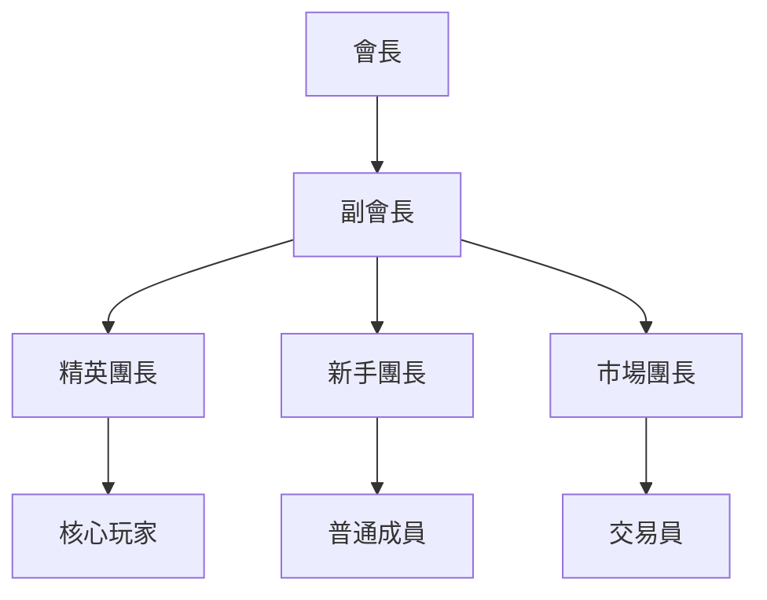
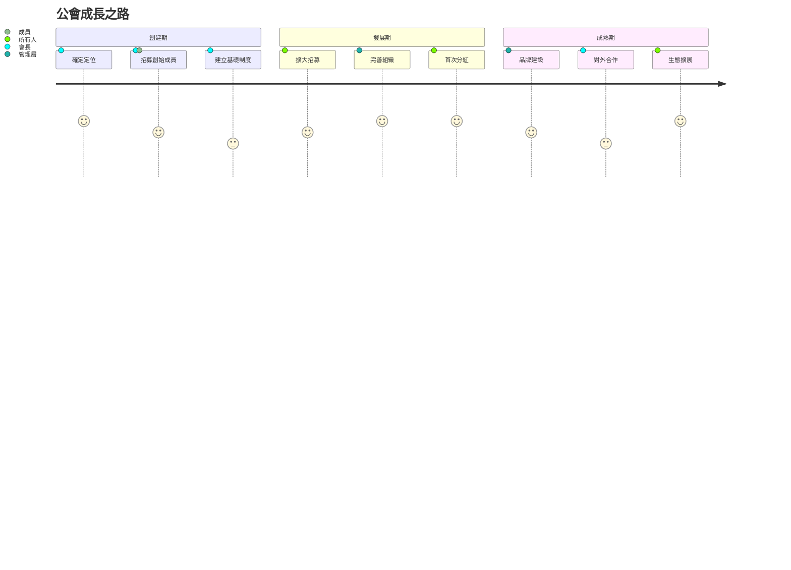

# 👥 公會管理與運營指南

建立和管理一個成功的 Soulbound Saga 公會，成為社群領袖！

## 🏛️ 公會系統概述

### 什麼是公會？

公會是玩家自發組織的遊戲社群，通過推薦系統形成利益共同體。

<div style="background: #e8f5e9; padding: 20px; border-radius: 10px;">

**公會優勢**
- 💰 推薦傭金收入（5% 永久）
- 🤝 資源共享與互助
- 📊 信息交流優勢
- 🏆 團隊競技優先權
- 🎁 專屬活動獎勵

</div>

## 🚀 創建公會步驟

### 第一步：準備階段

1. **確定公會定位**
   - 新手友好型
   - 精英競技型
   - 投資理財型
   - 休閒社交型

2. **制定公會章程**
   ```markdown
   # XX公會章程範例
   
   ## 公會宗旨
   - 互助共贏，共同成長
   - 信息共享，把握機遇
   - 公平分配，透明管理
   
   ## 加入條件
   - 最低投資：100 USDT
   - 活躍要求：每週至少登錄 5 天
   - 社群參與：加入 Telegram 群組
   
   ## 福利制度
   - 新手指導獎勵
   - 活躍玩家補貼
   - 大戶專屬服務
   ```

### 第二步：招募成員

#### 招募渠道
<table>
<tr>
<td width="33%">

**官方社群**
- Telegram 群組
- Discord 頻道
- Twitter 互動

</td>
<td width="33%">

**遊戲內**
- 世界頻道宣傳
- 好友邀請
- 排行榜招募

</td>
<td width="34%">

**外部平台**
- 加密貨幣論壇
- GameFi 社群
- YouTube/Bilibili

</td>
</tr>
</table>

#### 招募文案模板
```
🏰【XX公會】招募令 🏰

✨ 我們是 Soulbound Saga TOP10 公會
👥 現有成員：89人
💎 公會總戰力：125,000+
🏆 上週收益：50,000 SOUL

🎁 加入福利：
- 新人大禮包（價值 50 USDT）
- 一對一遊戲指導
- 獨家攻略分享
- 每週抽獎活動

📋 加入要求：
- 認同公會理念
- 保持日常活躍
- 使用公會推薦碼

立即加入：t.me/XXGuild
推薦碼：XXX123
```

## 💼 公會管理系統

### 組織架構



### 職責分工

| 職位 | 人數 | 主要職責 | 福利待遇 |
|------|------|---------|----------|
| 會長 | 1 | 戰略規劃、重大決策 | 傭金 30% |
| 副會長 | 2-3 | 日常管理、活動組織 | 傭金 20% |
| 團長 | 5-8 | 團隊帶領、技術指導 | 傭金 10% |
| 精英成員 | 20+ | 攻略研究、數據分析 | 優先分配 |
| 普通成員 | 不限 | 積極參與、信息反饋 | 基礎福利 |

## 📊 收益分配機制

### 推薦傭金分配

<div style="background: #f3e5f5; padding: 15px; border-radius: 8px;">

**標準分配方案**
```
總傭金收入（每月）
├── 40% - 公會發展基金
├── 30% - 管理團隊分紅
├── 20% - 活動獎勵池
└── 10% - 應急儲備金

發展基金用途：
- 新人扶持計劃
- 市場推廣費用
- 工具開發成本
- 戰略投資儲備
```

</div>

### 貢獻度系統

根據成員貢獻進行額外獎勵：

| 貢獻類型 | 積分 | 兌換標準 |
|---------|------|---------|
| 邀請新人 | 100 | 每成功 1 人 |
| 攻略創作 | 200 | 優質攻略 |
| 活躍簽到 | 10 | 每日簽到 |
| 幫助新手 | 50 | 有效指導 |
| 數據分享 | 150 | 重要情報 |

積分兌換：1000 積分 = 100 SOUL

## 🛠️ 公會工具箱

### 1. 數據追踪表格

```excel
成員管理表：
| 玩家ID | 加入時間 | 總投資 | 月收益 | 活躍度 | 貢獻值 |
|--------|---------|--------|--------|--------|--------|
| 001    | 2024-01 | $500   | $180   | 95%    | 2,500  |
| 002    | 2024-01 | $300   | $95    | 88%    | 1,800  |
```

### 2. 自動化工具

- **Discord Bot**：自動統計、積分管理
- **數據爬蟲**：市場價格監控
- **提醒系統**：活動通知、收益提醒

### 3. 教學資源庫

- 新手入門視頻
- 進階攻略文檔
- 收益計算器
- 市場分析報告

## 🎯 公會運營策略

### 短期目標（1-3個月）

1. **快速擴張期**
   - 目標：100 名活躍成員
   - 手段：推廣活動、新人獎勵
   - 預算：500-1000 USDT

2. **體系建立期**
   - 完善管理制度
   - 建立培訓體系
   - 開發輔助工具

### 中期目標（3-6個月）

1. **品牌建設**
   - 打造公會特色
   - 建立外部合作
   - 參與官方活動

2. **精英培養**
   - 識別核心玩家
   - 提供資源傾斜
   - 培養意見領袖

### 長期目標（6個月+）

1. **生態擴展**
   - 跨遊戲發展
   - 投資孵化項目
   - 建立 DAO 組織

## 💡 成功案例分享

### 案例：Dragon Guild 的崛起

<div style="background: #e3f2fd; padding: 20px; border-radius: 10px;">

**背景**
- 創建時間：2024年1月
- 初始成員：5人
- 初始資金：$1,000

**發展歷程**
1. 第一個月：通過社交媒體招募到 30 名成員
2. 第二個月：開發數據分析工具，吸引技術玩家
3. 第三個月：舉辦首屆公會賽，知名度大增
4. 第六個月：成為 TOP3 公會，月收入超 $50,000

**成功要素**
- ✅ 清晰的定位（數據驅動型）
- ✅ 強大的執行力
- ✅ 公平的分配機制
- ✅ 持續的創新能力

</div>

## 🚨 風險管理

### 常見問題及解決方案

| 問題 | 解決方案 |
|------|---------|
| 成員流失 | 定期活動、增強歸屬感 |
| 分配糾紛 | 透明公開、規則明確 |
| 發展瓶頸 | 對外合作、橫向擴展 |
| 內部矛盾 | 建立仲裁機制 |

### 危機處理預案

1. **大額資金被盜**
   - 立即凍結相關賬戶
   - 收集證據報警
   - 啟動應急基金

2. **核心成員離開**
   - 提前培養接班人
   - 知識文檔化
   - 利益綁定機制

## 📈 公會成長路線圖



---

<div align="center">

### 🏆 打造頂級公會

**記住：公會的核心是人，技術和資金只是工具**

[加入官方公會聯盟](https://t.me/SoulboundSaga_Guilds) | [公會排行榜](../data/guild-ranking.md) | [更多管理技巧](advanced-management.md)

</div>