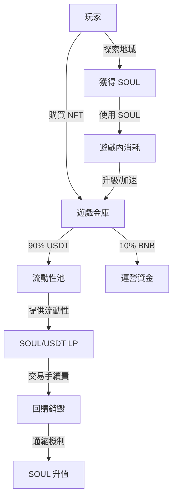
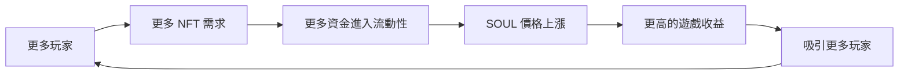

# 💎 Soulbound Saga 經濟模型解析

深入理解遊戲經濟系統，掌握財富密碼！

## 🌊 經濟循環概覽



## 🎯 U本位經濟模型 - 全球首創

### 什麼是U本位？

<div style="background: #e8f5e9; padding: 20px; border-radius: 10px;">

**🚀 革命性創新：穩定收益的遊戲經濟**

DungeonDelvers 是全球首個採用 **U本位（USD-pegged）** 獎勵系統的區塊鏈遊戲。

**傳統 vs U本位對比**
| 模式 | 每日獎勵 | SOUL=$0.01 | SOUL=$0.001 | SOUL=$0.1 |
|------|----------|------------|-------------|-----------|
| 傳統模式 | 1000 SOUL | $10 | $1 ❌ | $100 |
| U本位 | $10 USD | 1000 SOUL | 10000 SOUL ✅ | 100 SOUL |

**核心優勢**
- ✅ **收益穩定**：無論牛熊，USD價值恆定
- ✅ **熊市保護**：幣價越低，獲得代幣越多
- ✅ **自動平衡**：天然的價格支撐機制

</div>

## 💰 代幣經濟學

### SOUL 代幣模型

<div style="background: #f8f9fa; padding: 20px; border-radius: 10px;">

**基礎信息**
- 總供應量：1,000,000,000 SOUL
- 初始流通：通過 FOUR 平台公平發射
- 通脹率：U本位動態調節
- 通縮機制：多重銷毀

**代幣分配**
| 類別 | 比例 | 數量 | 鎖定期 |
|------|------|------|--------|
| 遊戲獎勵池 | 40% | 400M | 10年線性釋放 |
| 流動性 | 20% | 200M | 永久鎖定 |
| 團隊 | 15% | 150M | 2年線性解鎖 |
| 生態基金 | 15% | 150M | DAO 控制 |
| 早期投資 | 10% | 100M | 1年線性解鎖 |

</div>

### 價值支撐機制

#### 1. 收入分配模型
```
玩家支付 100 USDT 購買 NFT：
├── 90 USDT → 流動性池（提供 SOUL 價格支撐）
├── 5 USDT → 開發團隊
└── 5 USDT → 市場推廣

流動性池資金用途：
├── 50% 添加 SOUL/USDT 流動性
├── 30% 作為儲備金
└── 20% 市場做市
```

#### 2. 銷毀機制
- **升星銷毀**：失敗時銷毀材料 NFT
- **加速銷毀**：使用 SOUL 跳過冷卻
- **手續費銷毀**：交易手續費的 50% 銷毀
- **活動銷毀**：特殊活動消耗 SOUL

## 📊 收益模型分析

### 玩家收益來源

<table>
<tr>
<td width="50%">

**主動收益**
1. 地城探索獎勵
2. 首次通關獎勵
3. 活動任務獎勵
4. PvP 競技獎勵

</td>
<td width="50%">

**被動收益**
1. VIP 質押收益
2. LP 流動性挖礦
3. 推薦傭金收入
4. 公會分紅收益

</td>
</tr>
</table>

### 收益計算公式

#### 基礎地城收益
```
基礎收益 = 地城難度係數 × 成功率係數
戰力加成 = floor(總戰力 / 300) × 10%
VIP 加成 = VIP等級 × 5%
最終收益 = 基礎收益 × (1 + 戰力加成 + VIP加成)
```

#### 日收益預測模型
```javascript
function calculateDailyIncome(params) {
  const {
    partyPower,      // 隊伍戰力
    partyCount,      // 隊伍數量
    vipLevel,        // VIP 等級
    dungeonLevel,    // 地城難度
    successRate      // 成功率
  } = params;
  
  // 單次收益
  const baseReward = dungeonLevel * 10;
  const powerBonus = Math.floor(partyPower / 300) * 0.1;
  const vipBonus = vipLevel * 0.05;
  const singleReward = baseReward * (1 + powerBonus + vipBonus) * successRate;
  
  // 日收益（假設每隊每天 12 次）
  const dailyIncome = singleReward * 12 * partyCount;
  
  return {
    singleReward,
    dailyIncome,
    monthlyIncome: dailyIncome * 30,
    roi: (dailyIncome * 30) / (partyPower * 3) * 100 // 假設 3 USDT per power
  };
}
```

## 🏦 金庫經濟學

### 遊戲金庫機制

<div style="background: #fff3cd; padding: 15px; border-radius: 8px;">

**金庫資金流**
1. **流入**：NFT 銷售收入、SOUL 消耗
2. **鎖定**：90% 資金永久鎖定在流動性
3. **流出**：僅遊戲獎勵和運營支出

**透明度保證**
- 所有交易鏈上可查
- 金庫地址公開
- 定期審計報告

</div>

### 流動性深度分析

當前流動性狀況（示例）：
```
SOUL/USDT 池
├── SOUL: 50,000,000
├── USDT: 1,700,000
├── 價格: $0.034
└── TVL: $3,400,000

價格影響：
├── 買入 $10,000：+0.58%
├── 買入 $50,000：+2.94%
├── 買入 $100,000：+5.88%
└── 買入 $500,000：+29.41%
```

## 🎯 投資回報分析

### 不同玩家類型 ROI

<table>
<tr>
<th>玩家類型</th>
<th>初始投資</th>
<th>月收益</th>
<th>ROI</th>
<th>回本週期</th>
</tr>
<tr>
<td>休閒玩家</td>
<td>$100</td>
<td>$30</td>
<td>30%</td>
<td>3.3 個月</td>
</tr>
<tr>
<td>普通玩家</td>
<td>$500</td>
<td>$180</td>
<td>36%</td>
<td>2.8 個月</td>
</tr>
<tr>
<td>核心玩家</td>
<td>$2,000</td>
<td>$800</td>
<td>40%</td>
<td>2.5 個月</td>
</tr>
<tr>
<td>VIP玩家</td>
<td>$10,000</td>
<td>$4,500</td>
<td>45%</td>
<td>2.2 個月</td>
</tr>
<tr>
<td>鯨魚玩家</td>
<td>$50,000+</td>
<td>$25,000+</td>
<td>50%+</td>
<td>2.0 個月</td>
</tr>
</table>

### 風險評估

**低風險因素** ✅
- 90% 資金鎖定在流動性
- 多重收益來源
- 通縮代幣模型
- 活躍的社群

**潛在風險** ⚠️
- 新玩家增長放緩
- 市場整體下跌
- 競爭對手出現
- 監管不確定性

## 📈 增長飛輪



### 網絡效應
1. **玩家增長** → 市場活躍度提升
2. **交易增加** → 手續費收入增加
3. **社群壯大** → 品牌價值提升
4. **生態擴展** → 更多玩法和收益

## 💡 經濟策略建議

### 對普通玩家
1. 優先提升至 VIP 1（投資回報最高）
2. 保持 2-3 支活躍隊伍
3. 在市場低點囤積英雄
4. 參與所有限時活動

### 對投資者
1. 關注每月新增玩家數據
2. 監控流動性池變化
3. 追踪 SOUL 銷毀率
4. 評估團隊執行力

### 對大戶玩家
1. 建立公會獲取傭金
2. 提供 LP 獲取手續費
3. 市場做市套利
4. 參與 DAO 治理

---

<div align="center" style="background: linear-gradient(135deg, #667eea 0%, #764ba2 100%); padding: 20px; border-radius: 10px; color: white;">

### 🚀 把握經濟紅利期

當前處於遊戲早期，是最佳進入時機！

[查看實時數據](../data/realtime-dashboard.md) | [VIP 系統詳解](vip-system.md) | [投資建議](investment-guide.md)

</div>