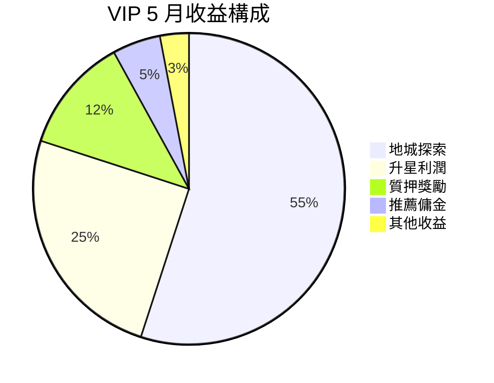
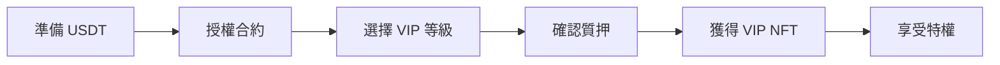

# 👑 VIP 會員系統詳解

成為 VIP，享受 Soulbound Saga 的頂級特權！質押 USDT，賺取更多收益。

## 🌟 VIP 系統概述

<div align="center">
  
</div>

### 核心機制

<div style="background: linear-gradient(135deg, #ffd700 0%, #ff6b35 100%); padding: 20px; border-radius: 10px; color: white;">

**質押即特權，收益即回報**

- 💎 **質押 USDT**：鎖定資產獲得 VIP 身份
- 🎯 **多重加成**：遊戲各方面收益提升
- 💰 **質押獎勵**：額外的 SOUL 代幣收益
- 🔓 **靈活解鎖**：隨時申請解鎖（有冷卻期）

</div>

## 📊 VIP 等級詳情

### 等級要求與權益

<table>
<tr>
<th>VIP 等級</th>
<th>質押要求</th>
<th>地城獎勵</th>
<th>升星成功率</th>
<th>冷卻減免</th>
<th>每日補給</th>
<th>專屬特權</th>
</tr>
<tr>
<td>⭐ VIP 1</td>
<td>10,000 USDT</td>
<td>+10%</td>
<td>+5%</td>
<td>-10%</td>
<td>5個</td>
<td>專屬頭像框</td>
</tr>
<tr>
<td>⭐⭐ VIP 2</td>
<td>50,000 USDT</td>
<td>+20%</td>
<td>+10%</td>
<td>-20%</td>
<td>10個</td>
<td>專屬稱號</td>
</tr>
<tr>
<td>⭐⭐⭐ VIP 3</td>
<td>100,000 USDT</td>
<td>+30%</td>
<td>+15%</td>
<td>-30%</td>
<td>20個</td>
<td>優先客服</td>
</tr>
<tr>
<td>⭐⭐⭐⭐ VIP 4</td>
<td>500,000 USDT</td>
<td>+40%</td>
<td>+20%</td>
<td>-40%</td>
<td>30個</td>
<td>定制 NFT</td>
</tr>
<tr>
<td>⭐⭐⭐⭐⭐ VIP 5</td>
<td>1,000,000 USDT</td>
<td>+50%</td>
<td>+25%</td>
<td>-50%</td>
<td>50個</td>
<td>遊戲決策權</td>
</tr>
</table>

### 質押收益計算

<div style="background: #e8f5e9; padding: 15px; border-radius: 8px;">

**月收益預估**（基於當前數據）

```javascript
function calculateVIPMonthlyIncome(vipLevel, stakedAmount) {
  // 基礎收益率（年化）
  const baseAPR = 0.12; // 12%
  
  // VIP 等級加成
  const vipBonus = {
    1: 1.1,   // +10%
    2: 1.2,   // +20%
    3: 1.35,  // +35%
    4: 1.5,   // +50%
    5: 1.75   // +75%
  };
  
  // 計算月收益
  const monthlyRate = baseAPR / 12;
  const vipMultiplier = vipBonus[vipLevel];
  const monthlyIncome = stakedAmount * monthlyRate * vipMultiplier;
  
  return {
    usdtIncome: monthlyIncome,
    soulIncome: monthlyIncome / 0.034, // 按當前 SOUL 價格
    apr: baseAPR * vipMultiplier * 100 + '%'
  };
}
```

</div>

## 💰 投資回報分析

### ROI 對比表

<table>
<tr>
<th>VIP 等級</th>
<th>質押金額</th>
<th>遊戲月收益</th>
<th>質押月收益</th>
<th>總月收益</th>
<th>月 ROI</th>
<th>回本週期</th>
</tr>
<tr>
<td>VIP 1</td>
<td>$10,000</td>
<td>~$800</td>
<td>~$110</td>
<td>~$910</td>
<td>9.1%</td>
<td>11 個月</td>
</tr>
<tr>
<td>VIP 2</td>
<td>$50,000</td>
<td>~$4,500</td>
<td>~$600</td>
<td>~$5,100</td>
<td>10.2%</td>
<td>10 個月</td>
</tr>
<tr>
<td>VIP 3</td>
<td>$100,000</td>
<td>~$10,000</td>
<td>~$1,350</td>
<td>~$11,350</td>
<td>11.4%</td>
<td>9 個月</td>
</tr>
<tr>
<td>VIP 4</td>
<td>$500,000</td>
<td>~$55,000</td>
<td>~$7,500</td>
<td>~$62,500</td>
<td>12.5%</td>
<td>8 個月</td>
</tr>
<tr>
<td>VIP 5</td>
<td>$1,000,000</td>
<td>~$125,000</td>
<td>~$17,500</td>
<td>~$142,500</td>
<td>14.3%</td>
<td>7 個月</td>
</tr>
</table>

### 收益來源分解



## 🎮 VIP 特權詳解

### 1. 遊戲內特權

<table>
<tr>
<td width="50%">

**戰鬥特權**
- 🏰 地城獎勵加成
- ⏱️ 冷卻時間減少
- 🎯 優先匹配權
- 💪 疲勞恢復加快

</td>
<td width="50%">

**經濟特權**
- 💰 交易手續費減免
- 📈 市場優先展示
- 🎁 每日免費補給
- 💎 專屬空投資格

</td>
</tr>
</table>

### 2. 社交特權

<div style="background: #f3e5f5; padding: 15px; border-radius: 8px;">

**VIP 專屬社交功能**

- **專屬頭像框**：彰顯尊貴身份
- **專屬稱號**：全服獨一無二
- **專屬頻道**：VIP 交流群組
- **優先客服**：1 對 1 專屬服務
- **活動優先**：搶先體驗新功能

</div>

### 3. 決策特權

**VIP 4-5 專享**
- 參與遊戲發展投票
- 提議新功能開發
- 優先測試新版本
- 影響經濟參數調整

## 🔐 質押與解鎖機制

### 質押流程



### 解鎖規則

<div style="background: #fff3cd; padding: 15px; border-radius: 8px;">

**⏰ 解鎖時間線**

1. **申請解鎖**：隨時可申請
2. **冷卻期**：7-30 天（根據等級）
3. **領取資產**：冷卻期滿後領取
4. **特權保留**：冷卻期間仍享受 VIP 特權

**冷卻期設置**
- VIP 1-2：7 天
- VIP 3：14 天
- VIP 4：21 天
- VIP 5：30 天

</div>

## 📈 VIP 進階策略

### 策略一：階梯式升級

<table>
<tr>
<td width="50%">

**執行步驟**
1. 從 VIP 1 開始
2. 積累收益 3 個月
3. 用收益升級 VIP 2
4. 重複直到 VIP 5

</td>
<td width="50%">

**優勢分析**
- ✅ 資金壓力小
- ✅ 風險可控
- ✅ 複利效應
- ✅ 穩步提升

</td>
</tr>
</table>

### 策略二：組團 VIP

**合作模式**
```
5 人組團 VIP 3：
- 每人出資：$20,000
- 共享賬號權益
- 收益按比例分配
- 降低個人門檻
```

### 策略三：VIP 套利

<div style="background: #e3f2fd; padding: 20px; border-radius: 10px;">

**市場套利機會**

1. **升星套利**
   - 利用 VIP 成功率加成
   - 批量升星賺差價
   - 月收益可達 20%+

2. **優先權套利**
   - 搶購限量 NFT
   - 優先參與活動
   - 轉手賺取溢價

3. **信息套利**
   - VIP 群組內幕消息
   - 提前布局市場
   - 把握價格波動

</div>

## 🏆 VIP 榮譽榜

### 當前 VIP 分佈

| VIP 等級 | 人數 | 佔比 | 總質押金額 |
|---------|------|------|-----------|
| VIP 5 | 12 | 0.1% | $12M |
| VIP 4 | 45 | 0.4% | $22.5M |
| VIP 3 | 156 | 1.5% | $15.6M |
| VIP 2 | 489 | 4.8% | $24.5M |
| VIP 1 | 1,847 | 18.2% | $18.5M |
| 非 VIP | 7,612 | 75% | - |

### VIP 收益排行

| 排名 | 玩家 | VIP 等級 | 本月收益 |
|------|------|---------|---------|
| 🥇 | CryptoWhale | VIP 5 | $156,890 |
| 🥈 | DeFiMaster | VIP 5 | $143,567 |
| 🥉 | Web3King | VIP 4 | $89,234 |

## 💡 VIP 常見問題

<details>
<summary><strong>Q: 質押的 USDT 安全嗎？</strong></summary>

A: 絕對安全！智能合約經過多重審計，資金隨時可查，解鎖機制透明。
</details>

<details>
<summary><strong>Q: 可以降級 VIP 嗎？</strong></summary>

A: 可以。解鎖部分資金後自動降級到對應等級，但需要經過冷卻期。
</details>

<details>
<summary><strong>Q: VIP 特權是永久的嗎？</strong></summary>

A: 只要保持質押，特權永久有效。解除質押後立即失去 VIP 身份。
</details>

<details>
<summary><strong>Q: 多人共享 VIP 賬號有風險嗎？</strong></summary>

A: 有一定風險。建議只與信任的朋友合作，並簽訂線下協議。
</details>

## 🎁 VIP 專屬活動

### 月度活動

<div style="background: #fce4ec; padding: 20px; border-radius: 10px;">

**🎊 VIP 專屬福利**

1. **月度抽獎**
   - VIP 1：1 張抽獎券
   - VIP 2：3 張抽獎券
   - VIP 3：5 張抽獎券
   - VIP 4：10 張抽獎券
   - VIP 5：20 張抽獎券

2. **專屬空投**
   - 新 NFT 優先認購權
   - 限量版皮膚贈送
   - SOUL 代幣獎勵

3. **線下聚會**
   - VIP 5 年度晚宴
   - VIP 3+ 季度聚會
   - 與團隊面對面交流

</div>

## 🚀 VIP 發展路線圖

### 即將推出

1. **VIP 專屬地城**（Q2 2025）
2. **VIP 對戰競技場**（Q3 2025）
3. **VIP DAO 治理**（Q4 2025）
4. **跨鏈 VIP 權益**（2026）

---

<div align="center" style="background: linear-gradient(135deg, #ffd700 0%, #ff6b35 100%); padding: 20px; border-radius: 10px; color: white;">

### 👑 加入 VIP，開啟尊貴之旅

**"Quality over Quantity, Privilege over Ordinary"**

[立即質押成為 VIP](https://app.soulboundsaga.com/vip) | [VIP 收益計算器](../tools/vip-calculator.md) | [VIP 專屬群組](https://t.me/SoulboundSaga_VIP)

</div>