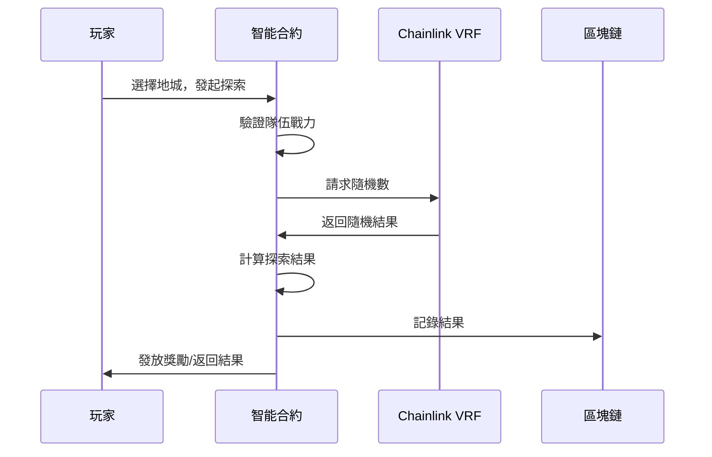

# 🏰 地城探索系統詳解

深入了解 Soulbound Saga 的核心玩法——地城探索！每一次冒險都是與區塊鏈的互動。

## 🗺️ 地城系統概述

<div align="center">
  
</div>

### 核心機制

<div style="background: linear-gradient(135deg, #1a237e 0%, #3949ab 100%); padding: 20px; border-radius: 10px; color: white;">

**完全上鏈的 Roguelike 體驗**

- 🎲 **鏈上隨機性**：使用 Chainlink VRF 保證公平
- ⛓️ **智能合約執行**：所有邏輯透明可驗證  
- 💎 **真實獎勵**：SOUL 代幣直接發放到錢包
- ⏱️ **冷卻機制**：防止機器人，保護經濟平衡

</div>

## 🏛️ 地城類型與難度

### 地城難度分級表

| 地城等級 | 名稱 | 戰力要求 | 基礎獎勵 | 成功率參考 | 冷卻時間 |
|---------|------|---------|---------|-----------|----------|
| Lv.1 | 新手地城 | 100+ | 10-20 SOUL | 95%+ | 2小時 |
| Lv.2 | 冒險地城 | 300+ | 30-50 SOUL | 85%+ | 2小時 |
| Lv.3 | 勇者地城 | 600+ | 70-100 SOUL | 75%+ | 3小時 |
| Lv.4 | 英雄地城 | 900+ | 150-200 SOUL | 65%+ | 4小時 |
| Lv.5 | 史詩地城 | 1200+ | 300-400 SOUL | 50%+ | 6小時 |
| Lv.6 | 傳說地城 | 1500+ | 500-700 SOUL | 35%+ | 8小時 |
| Lv.7 | 神話地城 | 2000+ | 1000+ SOUL | 20%+ | 12小時 |

### 特殊地城

<table>
<tr>
<td width="50%">

**🌟 活動地城**
- 限時開放
- 特殊獎勵（NFT/稀有道具）
- 無冷卻時間
- 需要活動門票

</td>
<td width="50%">

**👥 公會地城**
- 公會專屬
- 協作挑戰
- 共享獎勵池
- 每週重置

</td>
</tr>
</table>

## ⚔️ 戰鬥機制解析

### 戰力計算公式

```javascript
// 隊伍總戰力計算
function calculatePartyPower(heroes, relics) {
  let totalPower = 0;
  
  // 英雄戰力
  heroes.forEach(hero => {
    totalPower += hero.power;
  });
  
  // 聖物加成（每個聖物提供 5% 加成）
  const relicBonus = relics.length * 0.05;
  totalPower = totalPower * (1 + relicBonus);
  
  return Math.floor(totalPower);
}

// 成功率計算
function calculateSuccessRate(partyPower, dungeonPower) {
  const powerRatio = partyPower / dungeonPower;
  
  if (powerRatio < 1) return 0; // 戰力不足必定失敗
  if (powerRatio > 2) return 0.95; // 最高 95% 成功率
  
  // 線性計算：1.0 = 50%, 2.0 = 95%
  return 0.5 + (powerRatio - 1) * 0.45;
}
```

### 戰鬥流程



## 💰 獎勵系統

### 基礎獎勵計算

<div style="background: #e8f5e9; padding: 15px; border-radius: 8px;">

**獎勵公式**
```
基礎獎勵 = 地城等級 × 難度係數 × 隨機因子(0.8-1.2)
戰力加成 = floor(隊伍戰力 / 300) × 10%
VIP 加成 = VIP等級 × 10%
活動加成 = 活動期間額外 50%

最終獎勵 = 基礎獎勵 × (1 + 戰力加成 + VIP加成 + 活動加成)
```

</div>

### 額外掉落

| 掉落類型 | 概率 | 價值 | 備註 |
|---------|------|------|------|
| 經驗值 | 100% | - | 提升玩家等級 |
| SOUL 代幣 | 100% | 變動 | 主要收益來源 |
| 補給品 | 30% | 5 SOUL/個 | 用於恢復隊伍 |
| 神秘寶箱 | 5% | 50-500 SOUL | 隨機大獎 |
| 稀有材料 | 1% | 100+ SOUL | 未來用途 |
| NFT 碎片 | 0.1% | 1000+ SOUL | 合成稀有 NFT |

### 連勝獎勵

<table>
<tr>
<td width="50%">

**連勝機制**
- 3 連勝：獎勵 +10%
- 5 連勝：獎勵 +20%
- 10 連勝：獎勵 +50%
- 20 連勝：獎勵 +100%

</td>
<td width="50%">

**連勝中斷**
- 探索失敗
- 更換隊伍
- 24小時未探索

</td>
</tr>
</table>

## 🔄 冷卻與補給系統

### 冷卻時間管理

<div style="background: #fff3cd; padding: 15px; border-radius: 8px;">

**冷卻機制說明**

1. **基礎冷卻**：根據地城等級，2-12 小時不等
2. **立即重置**：花費 SOUL 代幣跳過冷卻
3. **VIP 減免**：VIP 等級越高，冷卻時間越短
4. **多隊輪換**：準備多支隊伍避免空窗期

**重置費用計算**
```
費用 = 剩餘分鐘數 × 0.5 SOUL
VIP 折扣 = VIP等級 × 10%
最終費用 = 費用 × (1 - VIP折扣)
```

</div>

### 補給品系統

**補給品用途**
- 恢復隊伍狀態
- 延長探索時間
- 提高獎勵倍率
- 特殊地城門票

**獲取方式**
1. 地城掉落（30% 概率）
2. 市場購買（5 SOUL/個）
3. 活動獎勵
4. VIP 每日領取

## 📊 地城數據分析

### 收益效率對比

```
日收益期望值（24小時，單隊伍）

新手地城（2h CD）：
- 12 次 × 15 SOUL × 95% = 171 SOUL

冒險地城（2h CD）：
- 12 次 × 40 SOUL × 85% = 408 SOUL

勇者地城（3h CD）：
- 8 次 × 85 SOUL × 75% = 510 SOUL

史詩地城（6h CD）：
- 4 次 × 350 SOUL × 50% = 700 SOUL

傳說地城（8h CD）：
- 3 次 × 600 SOUL × 35% = 630 SOUL
```

### 最優策略建議

<div style="background: #f3e5f5; padding: 20px; border-radius: 10px;">

**效率最大化策略**

1. **戰力匹配**：選擇成功率 70-80% 的地城
2. **多隊並行**：至少準備 3 支隊伍輪換
3. **時間管理**：設置鬧鐘提醒冷卻結束
4. **資源平衡**：補給品用於高價值地城
5. **活動優先**：活動期間集中資源衝刺

</div>

## 🎮 進階技巧

### 1. 地城選擇決策樹

```
IF 隊伍戰力 < 300
  THEN 選擇新手地城，穩定積累
ELSE IF 隊伍戰力 < 600
  THEN 選擇冒險地城，平衡風險
ELSE IF 隊伍戰力 < 1200
  THEN 計算勇者/英雄地城期望值
ELSE
  THEN 根據風險偏好選擇高級地城
```

### 2. 冷卻時間優化

| 策略 | 適用場景 | 預期收益提升 |
|------|---------|-------------|
| 自然冷卻 | 休閒玩家 | 基準線 |
| 部分重置 | 活躍玩家 | +30% |
| 完全重置 | 衝榜玩家 | +80% |
| VIP+重置 | 重度玩家 | +150% |

### 3. 風險管理

<table>
<tr>
<td width="50%">

**保守策略**
- 只打 85%+ 成功率地城
- 不使用冷卻重置
- 穩定但收益較低
- 適合長期玩家

</td>
<td width="50%">

**激進策略**  
- 挑戰 50% 成功率地城
- 頻繁使用重置
- 高風險高回報
- 適合資金充足玩家

</td>
</tr>
</table>

## 🏆 地城挑戰成就

### 成就系統

| 成就名稱 | 達成條件 | 獎勵 |
|---------|---------|------|
| 初出茅廬 | 完成首次探索 | 50 SOUL |
| 百戰百勝 | 累計成功 100 次 | 500 SOUL |
| 地城征服者 | 通關所有基礎地城 | 限定 NFT |
| 幸運之星 | 單次獲得 1000+ SOUL | 稱號 |
| 不屈不撓 | 失敗後立即成功 | 100 SOUL |

## 🔮 未來更新預告

<div style="background: #e3f2fd; padding: 20px; border-radius: 10px;">

**即將推出的功能**

1. **PvP 地城**：玩家對戰，贏家通吃
2. **無盡模式**：挑戰極限，獎勵翻倍
3. **boss 戰**：團隊協作，共享獎池
4. **賽季系統**：排行榜競賽，豐厚獎勵
5. **地城創造**：玩家自建地城，收取門票

</div>

---

<div align="center">

### ⚔️ 準備好征服所有地城了嗎？

每一次探索都是一次冒險，每一次成功都是一份收穫！

[查看實時地城數據](../data/dungeon-stats.md) | [隊伍配置建議](../advanced/party-optimization.md) | [經濟收益分析](../economy/earning-guide.md)

</div>