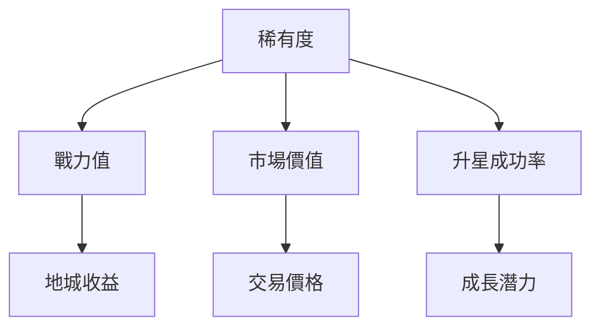

# ⚔️ 英雄系統

英雄是 Soulbound Saga 的核心。每個英雄都是獨一無二的 NFT，擁有隨機生成的屬性和無限的成長潛力。

## 🎭 英雄概述

<div align="center">
  
</div>

### 核心特性

<table>
<tr>
<td width="50%">

**🔗 區塊鏈原生**
- ERC-721 標準 NFT
- 完全上鏈存儲
- 永久所有權
- 自由交易

</td>
<td width="50%">

**🎲 隨機屬性**
- Chainlink VRF 保證公平
- 5 種稀有度
- 戰力值範圍廣泛
- 無法預測或操控

</td>
</tr>
</table>

## ⭐ 稀有度系統

英雄共有 5 個稀有度等級，稀有度決定了英雄的基礎戰力範圍：

<div style="background: #f8f9fa; padding: 20px; border-radius: 10px;">

| 稀有度 | 視覺效果 | 出現概率 | 戰力範圍 | 市場均價 |
|--------|---------|---------|---------|---------|
| ⭐ **普通** | 白色光環 | 50% | 10-30 | ~15 USDT |
| ⭐⭐ **稀有** | 綠色光環 | 30% | 40-70 | ~30 USDT |
| ⭐⭐⭐ **史詩** | 藍色光環 | 15% | 80-120 | ~80 USDT |
| ⭐⭐⭐⭐ **傳說** | 紫色光環 | 4% | 130-180 | ~200 USDT |
| ⭐⭐⭐⭐⭐ **神話** | 金色光環 | 1% | 200-300 | ~500 USDT |

</div>

### 稀有度價值分析



## ⚔️ 戰力系統

戰力是衡量英雄強度的唯一指標，直接影響：

### 1. 地城挑戰能力
- 隊伍總戰力必須超過地城要求
- 高戰力 = 可挑戰高難度地城 = 高獎勵

### 2. 獎勵計算
- 基礎獎勵 = 地城難度 × 成功率
- 戰力加成 = 總戰力 ÷ 300（向下取整）
- 最終獎勵 = 基礎獎勵 × (1 + 戰力加成 × 0.1)

### 3. 戰力分佈統計

<table>
<tr>
<td width="60%">

**當前服務器戰力分佈**（示例數據）

| 戰力區間 | 英雄數量 | 佔比 |
|---------|---------|------|
| 1-50 | 25,000 | 50% |
| 51-100 | 15,000 | 30% |
| 101-150 | 7,500 | 15% |
| 151-200 | 2,000 | 4% |
| 200+ | 500 | 1% |

</td>
<td width="40%">

**戰力提升途徑**
1. ⭐ 通過升星提升稀有度
2. 🎰 鑄造更多英雄尋找高戰力
3. 💱 市場購買高戰力英雄
4. 🤝 與其他玩家交易

</td>
</tr>
</table>

## 🎨 英雄外觀

每個英雄都有獨特的視覺呈現：

### NFT 圖像組成
1. **背景**：根據稀有度變化
2. **英雄形象**：隨機生成的角色
3. **光環效果**：稀有度標識
4. **數值顯示**：戰力值和編號

### 收藏價值
- 特殊編號（如 #1, #100, #1000）
- 極限戰力值（接近上限）
- 稀有組合（5星 + 高戰力）

## 🏭 英雄獲取方式

### 1. 直接鑄造（推薦新手）

<div style="background: #e3f2fd; padding: 15px; border-radius: 8px;">

**鑄造信息**
- 💰 價格：10 USDT/個
- ⛽ Gas費：約 0.001-0.002 BNB
- ⏱️ 時間：10-30 秒
- 📦 批量：最多 100 個/次

**鑄造策略**
- 新手建議：先鑄造 20-30 個建立基礎
- 進階玩家：等活動期間大量鑄造
- 高手技巧：觀察 Gas 價格低點鑄造

</div>

### 2. 市場購買

**優勢**：
- ✅ 可以選擇特定戰力
- ✅ 立即獲得所需英雄
- ✅ 可能撿到便宜貨

**劣勢**：
- ❌ 通常比鑄造貴
- ❌ 需要了解市場行情
- ❌ 可能買到高價

### 3. 升星獲得

通過祭壇升星系統，消耗低星英雄合成高星英雄：
- 5 個 1星 → 1 個 2星（成功率 45%）
- 5 個 2星 → 1 個 3星（成功率 30%）
- 詳見[升星系統](../upgrade/altar-system.md)

## 📊 英雄管理技巧

### 整理您的英雄庫

1. **按戰力排序**
   - 高戰力英雄：組建主力隊伍
   - 中戰力英雄：備用隊伍/交易
   - 低戰力英雄：升星材料

2. **按稀有度分類**
   - 保留高星英雄
   - 1-2星可作為升星材料
   - 3星以上謹慎處理

3. **制定保留策略**
   ```
   必留：4-5星所有英雄
   考慮：3星高戰力（>100）
   材料：1-2星低戰力（<50）
   ```

### 英雄交易建議

<table>
<tr>
<td width="50%">

**賣出時機**
- 📈 市場價格高於鑄造成本 30%
- 🎯 擁有同類型英雄過多
- 💰 需要資金升級 VIP
- 🔄 想要優化英雄組合

</td>
<td width="50%">

**買入時機**
- 📉 市場價格接近鑄造成本
- 🎯 急需特定戰力英雄
- ⭐ 發現低估的高星英雄
- 🎁 活動期間的特價

</td>
</tr>
</table>

## 🎮 實戰應用

### 組隊策略

1. **均衡型**：各種戰力英雄混搭
2. **極限型**：全部高戰力英雄
3. **門檻型**：精確控制總戰力在門檻值

### 地城匹配

| 隊伍戰力 | 推薦地城 | 預期收益 |
|---------|---------|---------|
| 100-299 | 新手地城 | 10-20 SOUL |
| 300-599 | 冒險地城 | 30-50 SOUL |
| 600-899 | 勇者地城 | 70-100 SOUL |
| 900+ | 史詩地城 | 150+ SOUL |

## ❓ 常見問題

<details>
<summary><strong>Q: 英雄會消失或損壞嗎？</strong></summary>

A: 不會！英雄是永久 NFT，除非您主動銷毀（升星失敗時）或轉移，否則永遠屬於您。
</details>

<details>
<summary><strong>Q: 可以改變英雄的戰力嗎？</strong></summary>

A: 英雄的基礎戰力在鑄造時確定，無法直接改變。但可以通過升星提升到更高稀有度，獲得新的戰力值。
</details>

<details>
<summary><strong>Q: 英雄數量有上限嗎？</strong></summary>

A: 理論上沒有上限，您可以擁有無限多的英雄。但要注意錢包性能和管理便利性。
</details>

---

<div align="center" style="margin-top: 40px;">

### 📚 延伸閱讀

[英雄屬性詳解](hero-attributes.md) | [稀有度與戰力](rarity-power.md) | [英雄獲取方式](hero-acquisition.md)

</div>