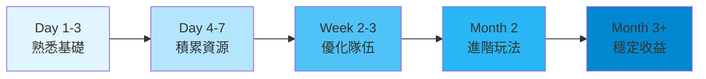

# 💡 新手必知10件事

在開始您的 Soulbound Saga 冒險之前，這 10 個關鍵知識點將幫助您避免常見錯誤，快速成為高手！

## 1️⃣ 戰力門檻是關鍵 🎯

**黃金法則：戰力達到 300 的整數倍時獎勵顯著提升！**

- 299 戰力 vs 300 戰力 = 獎勵差距可達 50%
- 599 戰力 vs 600 戰力 = 獎勵翻倍
- 優化隊伍時，寧可犧牲一點總戰力也要達到門檻

**💡 實用技巧**：使用戰力接近門檻值的英雄來精確調整

## 2️⃣ 批量鑄造省 Gas 費 ⛽

不要一個一個鑄造！批量操作可以節省高達 70% 的 Gas 費：

| 鑄造方式 | 單個 Gas 費 | 總 Gas 費 | 節省比例 |
|---------|------------|----------|---------|
| 單獨鑄造 10 個 | 0.002 BNB | 0.02 BNB | 0% |
| 批量鑄造 10 個 | - | 0.006 BNB | 70% |
| 批量鑄造 50 個 | - | 0.015 BNB | 85% |

## 3️⃣ 聖物容量 > 英雄數量 📦

很多新手只關注英雄，忽略了聖物的重要性：

- **聖物決定隊伍容量上限**
- 5 個 1 星聖物 = 25 容量 = 可帶 25 個英雄
- 1 個 5 星聖物 = 50 容量 = 頂兩個低星聖物

> 建議配比：每 10 個英雄配 2-3 個聖物

## 4️⃣ 別急著升星，先屯材料 ⭐

<table>
<tr>
<td width="50%">

**❌ 錯誤做法**
- 有材料就立即升星
- 用高價值英雄當材料
- 不考慮 VIP 加成

</td>
<td width="50%">

**✅ 正確做法**
- 累積足夠 1 星英雄
- 等待 VIP 等級提升
- 在活動期間升星

</td>
</tr>
</table>

## 5️⃣ 冷卻時間要算好 ⏰

每支隊伍探索後都有冷卻時間：

- 基礎冷卻：2 小時
- 可通過支付 SOUL 立即重置
- **技巧**：準備 2-3 支隊伍輪流探索，永不停歇！

## 6️⃣ 金庫獎勵要及時領 💰

**⚠️ 重要提醒**

金庫獎勵不會自動到賬！您需要：
1. 定期檢查金庫餘額
2. 手動點擊「領取」
3. 支付少量 Gas 費完成交易

**建議**：每天固定時間檢查一次

## 7️⃣ 推薦碼別忘記填 🤝

新玩家註冊時填寫推薦碼可獲得：
- 👤 **被推薦人**：首次鑄造 5% 返現
- 👥 **推薦人**：獲得 5% 永久傭金

如果您還沒有推薦人，可以在官方社群尋找活躍玩家的推薦碼。

## 8️⃣ 市場價格有規律 📊

NFT 市場價格通常遵循以下規律：

| 時間段 | 價格趨勢 | 操作建議 |
|--------|---------|---------|
| 週一至週三 | 價格較低 | 適合買入 |
| 週五至週日 | 價格較高 | 適合賣出 |
| 月初 | 需求旺盛 | 賣出時機 |
| 月末 | 供應增加 | 買入時機 |

## 9️⃣ VIP 值得投資 👑

VIP 不只是身份象徵，更是實實在在的收益提升：

| VIP 等級 | 質押 USDT | 升星加成 | 獎勵加成 | 月收益預估 |
|---------|-----------|---------|---------|------------|
| VIP 1 | 50K | +5% | +10% | ~500 SOUL |
| VIP 2 | 100K | +10% | +20% | ~1,200 SOUL |
| VIP 3 | 500K | +15% | +30% | ~7,000 SOUL |

**投資回報期**：通常 6-8 個月回本

## 🔟 社群資源要善用 🌐

不要單打獨鬥！加入社群可以：

- 🎁 獲取最新活動資訊
- 📚 學習高手經驗技巧
- 🤝 找到可靠的交易夥伴
- 🚨 及時了解系統更新

**官方社群連結**：
- 📱 [Telegram 中文群](https://t.me/Soulbound_Saga_CN)
- 🌍 [Discord 國際服](https://discord.gg/soulboundsaga)
- 🐦 [Twitter 官方號](https://x.com/Soulbound_Saga)

---

## 🎯 快速成長路線圖

根據以上 10 點，這是推薦的成長路線：

### 具體里程碑

| 時期 | 目標 | 關鍵指標 |
|------|------|---------|
| 第一週 | 建立基礎 | 擁有 50+ 英雄，2 支隊伍 |
| 第一月 | 穩定收益 | 日收入 100+ SOUL |
| 第三月 | 進階玩家 | VIP 2+，日收入 500+ SOUL |
| 第六月 | 資深玩家 | 建立公會，被動收入 1000+ SOUL |

---

### 🚀 準備好了嗎？

掌握這 10 個要點，您已經超越了 90% 的新手玩家！

現在就開始您的傳奇冒險吧！

[**👉 立即開始遊戲**](https://app.soulboundsaga.com)

