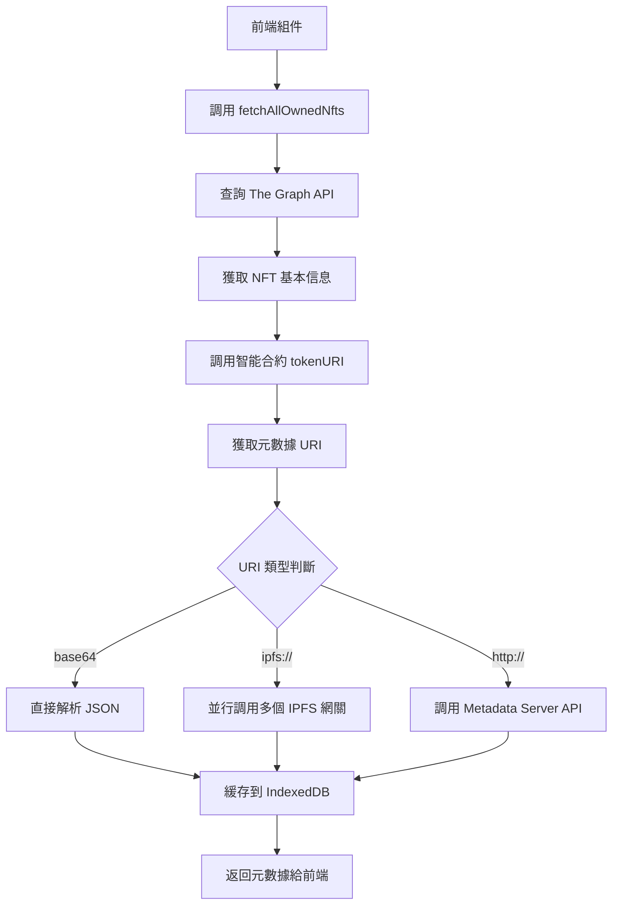

# Dungeon Delvers 伺服器資料調用架構分析

## 🏗️ 系統架構概覽

您的 Dungeon Delvers 項目採用多層架構來獲取和處理資料：

```
前端 (React/Vite)
    ↓
├── 直接調用智能合約 (Wagmi/Viem)
├── 調用 Metadata Server API (Express.js)
├── 調用 The Graph API (GraphQL)
└── 調用 IPFS 網關 (元數據和圖片)
    ↓
區塊鏈 (BSC) + 子圖 (The Graph)
```

## 🔍 具體的 API 端點實現位置

### 1. `api/hero` 等 API 端點位置

**後端實現位置**: `dungeon-delvers-metadata-server/src/index.js`

```javascript
// 英雄 NFT 元數據端點
app.get('/api/hero/:tokenId', handleRequest(async (req, res) => {
    const { tokenId } = req.params;
    const cacheKey = `hero-${tokenId}`;
    const id = `${contractAddresses.hero.toLowerCase()}-${tokenId}`;

    const metadata = await withCache(cacheKey, async () => {
        // 使用 DataLoader 從 The Graph 批量查詢
        const hero = await heroLoader.load(id);
        
        if (!hero) throw new Error(`Hero #${tokenId} not found in The Graph`);

        // 生成動態 SVG 圖片
        const svgString = generateHeroSVG({ rarity: hero.rarity, power: BigInt(hero.power) }, BigInt(tokenId));
        const image_data = Buffer.from(svgString).toString('base64');
        
        return {
            name: `Dungeon Delvers Hero #${tokenId}`,
            description: "A brave hero from the world of Dungeon Delvers, ready for adventure.",
            image: `data:image/svg+xml;base64,${image_data}`,
            attributes: [ 
                { trait_type: "Rarity", value: hero.rarity }, 
                { trait_type: "Power", value: Number(hero.power) },
                { trait_type: "Created At", value: Number(hero.createdAt), display_type: "date" }
            ],
        };
    }, 'hero');
    res.json(metadata);
}));
```

**所有 API 端點**:
- `GET /api/hero/:tokenId` - 英雄 NFT 元數據
- `GET /api/relic/:tokenId` - 聖物 NFT 元數據  
- `GET /api/party/:tokenId` - 隊伍 NFT 元數據
- `GET /api/vip/:tokenId` - VIP NFT 元數據
- `GET /api/profile/:tokenId` - 玩家檔案 NFT 元數據
- `GET /health` - 服務健康狀態

### 2. 前端 API 調用位置

**核心 API 文件**: `src/api/nfts.ts`

```typescript
// 元數據獲取函數
export async function fetchMetadata(
    uri: string, 
    tokenId: string, 
    contractAddress: string, 
    retryCount = 0
): Promise<Omit<BaseNft, 'id' | 'contractAddress' | 'type'>> {
    
    // 1. 先檢查IndexedDB緩存
    const cachedMetadata = await nftMetadataCache.getMetadata(tokenId, contractAddress);
    if (cachedMetadata) {
        return cachedMetadata;
    }
    
    // 2. 從不同來源獲取元數據
    if (uri.startsWith('data:application/json;base64,')) {
        // 直接解析 base64 編碼的元數據
        const json = Buffer.from(uri.substring('data:application/json;base64,'.length), 'base64').toString();
        metadata = JSON.parse(json);
    } else if (uri.startsWith('ipfs://')) {
        // 從 IPFS 載入元數據
        const ipfsHash = uri.replace('ipfs://', '');
        const gateways = [
            `https://ipfs.io/ipfs/${ipfsHash}`,
            `https://gateway.pinata.cloud/ipfs/${ipfsHash}`,
            `https://cloudflare-ipfs.com/ipfs/${ipfsHash}`,
            `https://dweb.link/ipfs/${ipfsHash}`
        ];
        metadata = await fetchWithMultipleGateways(gateways, timeout);
    } else {
        // 從 HTTP 載入元數據
        metadata = await fetchWithTimeout(uri, timeout);
    }
    
    // 3. 成功獲取後立即緩存
    await nftMetadataCache.cacheMetadata(tokenId, contractAddress, metadata);
    
    return metadata;
}
```

## 🔄 完整的資料獲取流程

### 流程 1: NFT 元數據獲取



### 流程 2: 頁面級資料獲取

以 `ProfilePage.tsx` 為例:

```typescript
// 1. 前端頁面調用
const response = await fetch(THE_GRAPH_API_URL, {
  method: 'POST',
  headers: { 'Content-Type': 'application/json' },
  body: JSON.stringify({ query: GET_PLAYER_PROFILE_QUERY })
})

// 2. GraphQL 查詢
const GET_PLAYER_PROFILE_QUERY = `
  query GetPlayerProfile($playerId: ID!) {
    player(id: $playerId) {
      profile {
        id
        tokenId
        level
        experience
      }
      heroes { id tokenId power rarity }
      relics { id tokenId capacity rarity }
      parties { id tokenId totalPower }
      vip { id tokenId stakedAmount level }
    }
  }
`;
```

## 🌐 資料來源詳細分析

### 1. The Graph API (GraphQL 子圖)
- **位置**: `DDgraphql/` 目錄
- **用途**: 查詢區塊鏈上的遊戲數據
- **端點**: `VITE_THE_GRAPH_STUDIO_API_URL`
- **數據類型**: 英雄、聖物、隊伍、VIP、玩家檔案

### 2. Metadata Server API (Express.js 後端)
- **位置**: `dungeon-delvers-metadata-server/src/index.js`
- **用途**: NFT 元數據服務和動態 SVG 生成
- **端點**: `http://localhost:3001` (預設)
- **技術棧**: Express.js + Redis 緩存 + DataLoader 批量查詢

### 3. 智能合約直接調用
- **位置**: 前端通過 Wagmi/Viem 調用
- **用途**: 獲取 tokenURI、VIP 等級等實時數據
- **合約地址**: 
  - Hero: `VITE_MAINNET_HERO_ADDRESS`
  - Relic: `VITE_MAINNET_RELIC_ADDRESS`
  - Party: `VITE_MAINNET_PARTY_ADDRESS`
  - VIP: `VITE_MAINNET_VIPSTAKING_ADDRESS`

### 4. IPFS 網關
- **用途**: 載入 NFT 圖片和元數據
- **網關列表**:
  - `https://ipfs.io/ipfs/`
  - `https://gateway.pinata.cloud/ipfs/`
  - `https://cloudflare-ipfs.com/ipfs/`
  - `https://dweb.link/ipfs/`

## 🎯 具體調用示例

### 示例 1: 獲取英雄 NFT 元數據

```typescript
// 1. 前端調用 (src/components/ui/NftCard.tsx)
const { data: tokenURI } = useReadContract({
  address: heroContractAddress,
  abi: heroAbi,
  functionName: 'tokenURI',
  args: [tokenId],
})

// 2. 解析 tokenURI 並獲取元數據
const metadata = await fetchMetadata(tokenURI, tokenId, contractAddress);

// 3. 如果 tokenURI 指向 metadata server，會調用:
// GET http://localhost:3001/api/hero/123
```

### 示例 2: 獲取用戶所有 NFT

```typescript
// 1. 前端調用 (src/pages/MyAssetsPage.tsx)
const { data: nfts } = useQuery({
  queryKey: ['userNfts', address, chainId],
  queryFn: () => fetchAllOwnedNfts(address!, chainId),
})

// 2. 內部查詢 The Graph API
const response = await fetch(THE_GRAPH_API_URL, {
  method: 'POST',
  body: JSON.stringify({
    query: GET_PLAYER_ASSETS_QUERY,
    variables: { owner: address.toLowerCase() }
  })
});

// 3. 批量獲取每個 NFT 的元數據
const results = await batchProcess(assets, async (asset) => {
  const metadata = await fetchMetadata(asset.tokenURI, asset.tokenId, contractAddress);
  return { ...asset, ...metadata };
});
```

## 🚀 性能優化策略

### 1. 多級緩存系統
- **IndexedDB**: 前端本地緩存 (src/cache/)
- **Redis**: 後端 metadata server 緩存
- **Apollo Client**: GraphQL 查詢緩存
- **React Query**: REST API 數據緩存

### 2. 並行請求優化
- **多個 IPFS 網關並行**: 同時請求多個網關，使用最快的
- **批量處理**: 限制並發請求數量，避免過載
- **DataLoader**: 後端批量查詢，減少 GraphQL 請求

### 3. 錯誤處理和重試
- **指數回退重試**: 失敗後逐漸增加重試間隔
- **降級策略**: 失敗時返回 fallback 數據
- **超時設置**: 漸進式增加超時時間

## 🔧 環境配置

### 必要的環境變數

```bash
# GraphQL API
VITE_THE_GRAPH_STUDIO_API_URL=https://api.studio.thegraph.com/...

# 智能合約地址
VITE_MAINNET_HERO_ADDRESS=0x...
VITE_MAINNET_RELIC_ADDRESS=0x...
VITE_MAINNET_PARTY_ADDRESS=0x...
VITE_MAINNET_VIPSTAKING_ADDRESS=0x...

# RPC 端點
VITE_ALCHEMY_BSC_MAINNET_RPC_URL=https://...
VITE_INFURA_BSC_MAINNET_RPC_URL=https://...
```

## 📊 監控和診斷

### 1. 健康檢查端點
```http
GET /health
```

### 2. 緩存統計
```http
GET /admin/cache/stats
```

### 3. 性能指標
```http
GET /admin/metrics
```

## 🎮 總結

您的 Dungeon Delvers 項目使用了一個高度優化的多層架構來獲取資料：

1. **前端**: React 組件通過 Wagmi/Viem 調用智能合約，通過 Apollo Client 查詢 The Graph
2. **後端**: Express.js metadata server 提供 NFT 元數據 API，集成 Redis 緩存
3. **區塊鏈**: BSC 智能合約存儲核心數據
4. **子圖**: The Graph 索引區塊鏈數據，提供 GraphQL API
5. **IPFS**: 分散式存儲 NFT 元數據和圖片

這個架構確保了高性能、高可用性和良好的用戶體驗，同時通過多級緩存和並行請求優化了載入速度。